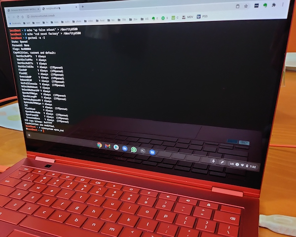
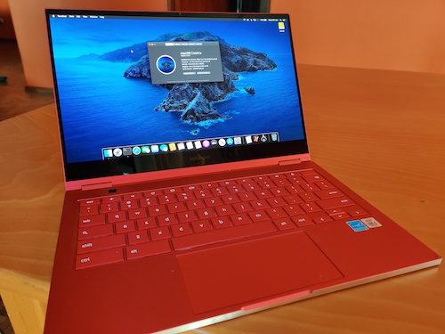

# Samsung Galaxy Chromebook Multiboot
Install guide for multibooting ChromeOS, Linux, Windows 10/11 and Mac OS.

|      |       |
|------------|-------------|
|||

### Why?
A recent UEFI firmware lets us boot what we want. This laptop has a beautiful design and is available now for half the original price. The goal of this repo will be to detail the process for multi-boot of various operating systems. Not all of the functionality is working but this will be updated as fixes are identified. 

### Disclaimer

You know this already: The process described in this document could cause irreversible damage to your expensive laptop, and
you should prepare yourself mentally and emotionally for that outcome before you begin. I accept absolutely no responsibility for the consequences of anyone choosing to follow or ignore any of the instructions in this document, and make no guarantees about the quality or effectiveness of the
software in this repo.

### Samsung Galaxy Chromebook (Gen 1) Hardware
Specs:
-  CPU: Intel i5-10210U (Cometlake)
-  GPU: Intel UHD 620
-  RAM: 8GB Soldered to motherboard
-  Audio: Intel Smart Sound Technology (only works with Sound Open Firmware on Linux & Chrome OS). On CrOS, uses driver sof-cmlda7219max 
-  Wifi/BT Card: Intel AX201 
-  Touchpad: Synaptics TM3579-001 (only works on Linux and Chrome OS). 
-  SSD: 256GB NVME M.2 - Easily upgradable to 1TB for $200 following [MrHG78's guide](https://www.youtube.com/watch?v=QAyFRj-gORI).

### OS Compatibility Current Status
Outside of ChromeOS in Brunch, Linux has the best support (especially Manjaro and Fedora) for this hardware. Windows is easy to install but currently has missing audio. Mac OS is sluggish without accelerated graphics, audio and other functionality. 

On all installations below, bluetooth works out of the box and therefore audio / external mouse is a solution to the internal audio & touchpad problems noted. Also, battery and power management work for all (even MacOS has working battery percentage).  


| Hardware           | Linux (Manjaro, Fedora)| Mac OS Catalina     | Windows 10/11   | Brunch		|
|--------------------|----------------------|---------------------|-----------------|-------------------|
| WiFi               | Working              | Working             | Working         | Working		|
| Bluetooth          | Working              | Working             | Working	    | Working		|
| Suspend / Sleep    | Working (see note)   | Not Working        | Working         | Working 		|
| Touchpad           | Working	            | Not Working         | Working     | Working           |
| Graphics Accel.    | Working              | Not Working	  | Working    	    | Working 		|
| Sound              | Working (SOF)        | Not Working         | WIP	    | Working (see below)|
| Keyboard backlight | Working              | Not Working         | Working     | Working		|
| Touchscreen        | Working              | Not Working         | Working  | Working 		|
| Screen brightness  | Working		    | Not Working	  | Working	    | Working		|


## Part 1: Firmware Write Protect

Before you start, you'll need to open the write protect for this machine's CR50 security chip. Start by [reading this wiki by MrChromebox](https://wiki.mrchromebox.tech/Firmware_Write_Protect) to understand what you'll be doing. For this laptop, there are two options. If you have a SuzyQable CCD Debugging cable, read below. Otherwise, open up the laptop and disconnect the battery. Then skip to Part 2 below:

- A [SuzyQable CCD Debugging cable](https://www.sparkfun.com/products/14746), ~$15 USD + shipping
- A USB-A to USB-C adapter
- You must be in developer mode. Turn off the device and hold Power + ESC + REFRESH until the recovery screen appears, then press CTRL+D. It takes about 30 minutes to switch over. Plug in the laptop and make some coffee.
- Read the [Firmware Write Protect](https://wiki.mrchromebox.tech/Firmware_Write_Protect) wiki article again. Start at the section entitled "Disabling WP on CR50 Devices via CCD."
- The device will ask you to press the power button several times during 3 minutes. Once finished, it will power off.
- Upon booting again, it will switch back to regular mode. You must shutdown and switch back over to Developer Mode. Same procedure as before and another 30 minutes of waiting.
- Verify at the end that WP has been disabled with `sudo gsctool -a -I`  


## Part 2: UEFI Firmware Utility Script: MrChromebox's Coreboot installer
The next step is to get Coreboot installed so we can install other operating systems.

- Read MrChromebox's install [instructions carefully.](https://mrchromebox.tech/#fwscript)
- The latest firmware supports all Cometlake ChromeOS devices, including this laptop. Run the script provided.
- Follow the on-screen prompts and make sure you save a backup of the stock firmware!

## Part 3: Linux (Manjaro, Fedora)
Burn ISO, boot and configure. Other distros will work with varying hardware support - in my experience, Fedora and Manjaro work best out of the box. 
 - In order for sound to work, we need `sof-firmware`. You must be on a distro with a kernel 5.10 and up. Fedora works out of the box, Manjaro does as well (as long as you install sof-firmware).   
 - Sleep: MrChromebox's firmware defaults the mem-sleep/suspend state to `sleep-2-idle`, which really isn't suspend at all. Passing the kernel parameter  `mem_sleep_default=deep` will ensure sleep works correctly.  (thanks to @sos-michael)
 - In Fedora, you may need to blacklist `elants_i2c`. It was hanging sleep for some users. Do this in terminal: `echo "blacklist elants_i2c" | sudo tee /etc/modprobe.d/blacklist.conf`
 - For touchscreen to work, @CabbageSong found a great solution - use the same procedure as the previous tip: "Add blacklist atmel_mxt_ts to /etc/modprobe.d/blacklist.conf and it works after reboot." It appears the atmel touchscreen driver hijacks the Elan touchscreen of this machine. 
 - In Arch / Manjaro, some users report sleep is causing the machine to stop responding. To fix both the touchscreen and sleep problems, add these two lines to blacklist.conf:
```
$ cat /etc/modprobe.d/blacklist.conf 
blacklist atmel_mxt_ts
blacklist cros_ec_typec
``` 

## Part 4: Windows 10/11 (now with improved drivers!)
For Windows, you will need a driver utility beyond what Windows Update can find on its own. Driver Booster is one option, or try [Snappy](https://www.snappy-driver-installer.org/). Also, on Discord, @Coolstar revealed major progress for driver support on Windows. 
- All drivers now signed by Microsoft WHQL -- will work with Secure Boot on Windows 10 19H1 and higher
- Brightness key adjustments now work properly

Downloads to enable Synaptics touchpad / Atmel touchscreen (some of us have Atmel, some have Elan touchscreens, depends on the device - try it, and if it works, you have Atmel, congrats). 

1. Keyboard Remap Utility - on [coolstar.og](https://coolstar.org) and https://github.com/coolstar/driverinstallers
2. Touchpad (Cypress/Elan/Synaptics/Atmel) - on [coolstar.og](https://coolstar.org) and https://github.com/coolstar/driverinstallers
3. Touchscreen - [https://coolstar.org/chromebook/downloads/drivers/crostouchscreen.2.9.1-installer.exe](https://github.com/coolstar/driverinstallers/raw/master/crostouchscreen/crostouchscreen.2.9.3-installer.exe)
4. Sound - stay tuned for an update from Coolstar about new drivers. Join the Chrultrabook Discord server for the latest info. 

- For best results make sure to uninstall existing drivers from add/remove programs
- Keyboard remap might not show up in add/remove programs -- navigate to C:\Program Files\chromebookremap and run uninstall.exe to uninstall the old version before installing the new one
- Drivers may not work on Windows 10 versions older than 19H1 

## Part 5: MacOS Catalina
Download the lastest version of Opencore. Catalina is recommended for this hardware. We have non-working native nvram, so Big Sur will not install until this is fixed in a future firmware update from MrChromebox. Emulated nvram does seem to work. 
 
1. Download and set up your Mac OS X Catalina USB install media. [gibMacOS](https://github.com/corpnewt/gibMacOS) 
    - Before you make the install USB, make sure it is formatted as Mac OS Extended (Journaled) with GUID Partition Map.
    - To create the installer on a Mac in Terminal: `sudo /Applications/Install\ macOS\ Catalina.app/Contents/Resources/createinstallmedia --volume /Volumes/MyVolume` and replace MyVolume with the name of your target drive.

2. Create your EFI based on the latest OC Guide for [this Comet Lake generation](https://dortania.github.io/OpenCore-Install-Guide/config-laptop.plist/coffee-lake-plus.html).
    
3. When the Catalina install media is ready, mount the EFI partition with the [MountEFI](https://github.com/corpnewt/MountEFI) utility and copy the contents of the latest EFI linked above into this partition.
    - Make sure to copy the entire contents of the EFI above, starting from the EFI folder itself. So inside the EFI partition it should start with EFI, followed by BOOT and OC folders, etc. 

4. Now, boot from the Catalina installer. In Disk Utility, go to Show All Devices in the top left, and then select the entire drive to format it as APFS.
    - After about 10 minutes or so, it will reboot. Go back into the boot menu and select your Catalina install media. In the opencore boot menu you should now see "Mac OS Install" as a menu item. Select that to continue the installation. 
    - The second phase of the installation will continue for about 15-20 minutes. 
  
5. Before you can boot from the new Catalina installation, you will need to copy the EFI to your insternal SSD drive using the same procedure from step 3.  

6. Read the [OpenCore guide](https://dortania.github.io/OpenCore-Install-Guide/) on how to improve this hackintosh build and contribute here.

7. Help figure out graphics acceleration. I can share a few ideas, but everything I've tried so far has not worked.


## Part 6: Brunch - install ChromeOS on a partition.
Brunch installs the native recovery image for our device into an image and allows full access to the hardware with a few exceptions:
 - Fingerprint reader does not work (expected behavior) 
 - Google Play is a work in progress. According to some users, it works on beta channel.
 - Audio works, but the headphone jack does not. Plugging in to the audio jack results in louder speakers.  

 1. Read the instructions on the official Brunch repo: [https://github.com/sebanc/brunch](https://github.com/sebanc/brunch)
 2. Go to [Chromiumdash](https://chromiumdash.appspot.com/serving-builds?deviceCategory=Chrome%20OS) and search for "hatch", then download the latest recvovery. 
 3. You will need either an external mini SD card / USD to run Brunch off of, or you can create an EXT4 partition on the internal drive. Make sure it is at least 14GB in size - probably bigger than that if you plan to install any apps.
 4. After installing using the steps in the Brunch guide, you will be provided with a Grub menu to copy into your bootloader. What needs to be changed for our machine to run properly are the following four options: 
 
 - `kernel-4.19` needed for our hardware to work properly
 - `options=native_chromebook_image` tells Brunch to use the native drivers for our machine within the hatch image.
 - `iwlwifi_backport` is for the wifi to work 
 - `enable_updates` will allow you to update to new CrOS releases

This is an older Grub entry with those options added. Do not use this as it won't work anymore - use your own that is generated from the brunch install script.

```
menuentry "ChromeOS" {
	img_part=/dev/nvme0n1p3
	img_path=/chromos.img
	search --no-floppy --set=root --file $img_path
	loopback loop $img_path
	linux (loop,7)/kernel-4.19 boot=local noresume noswap loglevel=7 disablevmx=off \
		cros_secure cros_debug options=native_chromebook_image,iwlwifi_backport,enable_updates loop.max_part=16 img_part=$img_part img_path=$img_path \
		console= vt.global_cursor_default=0 brunch_bootsplash=default
	initrd (loop,7)/lib/firmware/amd-ucode.img (loop,7)/lib/firmware/intel-ucode.img (loop,7)/initramfs.img
```
